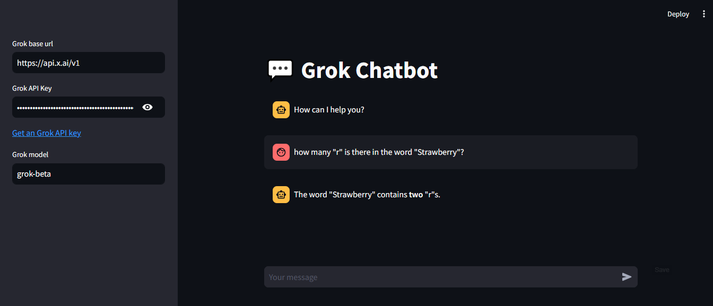

# Streamlit-grok-chatbot
simple chatbot using Streamlit framework to create web application.

This Streamlit app is integrated with the Grok API to offer a chat interface where users can interact with advanced language models. It enables users to choose between two models for generating responses, improving the flexibility and user experience of the chat application.
model is Grok from xAI

